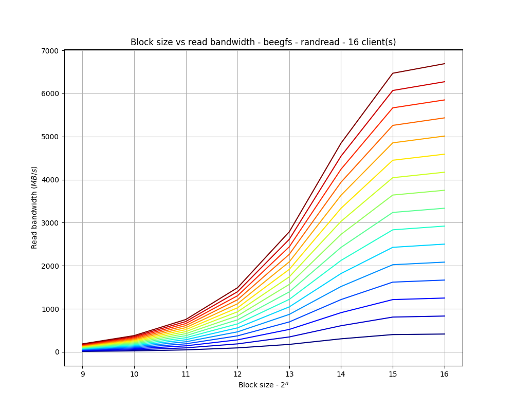

# To install

Installation from local files into a local virtualenv:

    virtualenv venv
    source venv/bin/activate
    pip install .

Installation direct from the git repo:

    pip install git+https://github.com/stackhpc/stackhpc-io-tools

# To build and push docker image

    make docker DOCKER_ID=stackhpc

# To run fio locally (which launches a single client locally)

The `DATA_PATH` and `RESULTS_PATH` here refer to the path to read the
data from and dump results to locally.

    make local SCENARIO=beegfs FIO_RW=randread NUM_CLIENTS=1 \
      DATA_PATH=/path-to-test-dir RESULTS_PATH=/path-to-result-dir

# To run remote baremetal batch jobs:

This expects you to be able to SSH into the nodes normally and `fio_jobfiles` is available in the home directory of the default user which you can copy over using the following:

    make copy NUM_NODES=2 NODE_PREFIX=centos@kata-worker

Then to invoke the batch job:

    for c in 1 64; do
      for rw in write randwrite read randread; do
        make remote SCENARIO=beegfs FIO_RW=$rw NUM_CLIENTS=$c \
          DATA_PATH=/mnt/storage-nvme \
          RESULTS_PATH=/mnt/storage-nvme/bharat/results/bare \
          NUM_NODES=2 NODE_PREFIX=centos@kata-worker
      done
    done

If you have a large number of clients, make sure that you update the
MaxStartups paramater in `/etc/ssh/sshd_config` and restart `sshd` in worker
nodes otherwise your connections may get dropped because the default setting of
`10:30:50` means that `30%` of connections when there are more than `10` will get
dropped up to a maximum of `50` after which all connections are dropped.

# To run as a Kubernetes job:

The `DATA_HOSTPATH` and `RESULTS_HOSTPATH` here refer to the path to read the
data from and dump results to on the Kubernetes worker nodes. These paths are
mapped to the default `DATA_PATH` and `RESULTS_PATH` inside containers spawned
by Kubernetes.

    for c in 1 64; do
      for rw in write randwrite read randread; do
        make k8s SCENARIO=beegfs FIO_RW=$rw NUM_CLIENTS=$c \
          DATA_HOSTPATH=/mnt/storage-nvme/bharat \
          RESULTS_HOSTPATH=/mnt/storage-nvme/bharat/results/runc
      done
    done

There is an option to add `RUNTIME_CLASS` if it is supported by the Kubernetes cluster:

    for c in 1 64; do
      for rw in write randwrite read randread; do
        make k8s SCENARIO=beegfs FIO_RW=$rw NUM_CLIENTS=$c \
          DATA_HOSTPATH=/mnt/storage-nvme \
          RESULTS_HOSTPATH=/mnt/storage-nvme/bharat/results/kata \
          RUNTIME_CLASS=kata-qemu
      done
    done

As the test is running, it might be useful to look at the verbose output of the test as follows:

    kubectl --namespace default logs jobs/beegfs-randread-1 --follow

For debugging, you can also invoke shell inside the pod:

    kubectl --namespace default exec -it beegfs-randread-1-n44kj sh

# To generate plot:

    make parse RESULTS_PATH=/path-to-result-dir OUTPUT_PATH=/path-to-output-dir

NOTE: `RESULTS_PATH` is the path for raw data generated by `fio` and
`OUTPUT_PATH` is the parsed data analysed by `bin/fio_parse` executable
presented in this repo.

# Typical output figures:

